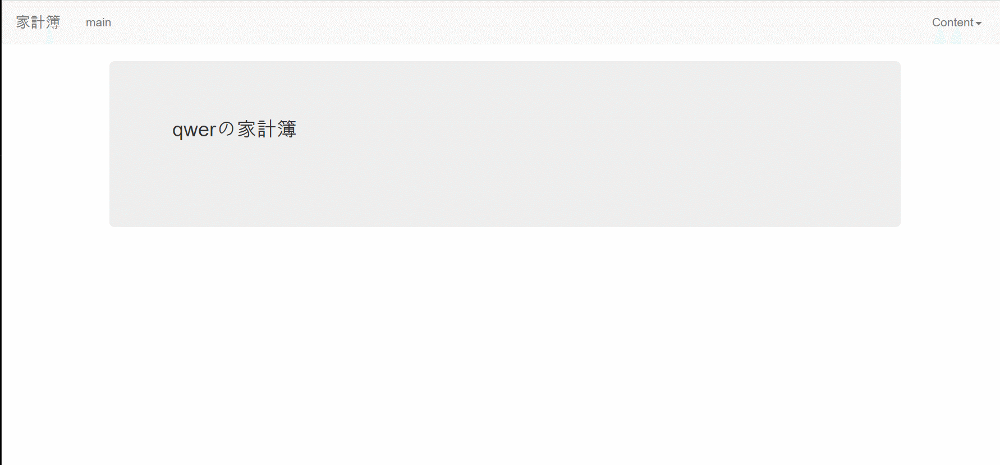

# 家計簿--個人プロジェクト

# 目的

- 新人web開発者の基本的素養
- どのwebでも掲示板は必須
- 繰り返しの練習で速くて安定的にすることを目指す。

## 開発環境

**Front-End**
- Bootstrap 3
- jQuery
- Ajax

**Back-End**
- Spring 4.3.6
- JDK 1.8
- Oracle
- Mybatis 3.4.6
- Tomcat 9
- Maven 2.9

## プロジェクト要求事項

- モバイル、デスクトップすべての環境で使用可能で
 なければなりません。
 
-  サイトにはメンバーというユーザだけがいます。

- メンバーは会員加入をすることができます

- メンバーはログインすることができます

- ログインに成功したら、
  画面右上にContentが表示されます。
  
- メンバーは、 家計簿で「家計簿作成」、
 「家計簿修正」、「家計簿削除」、「合計金額と最大最小金額」機能を利用します。
 
 - メンバーは自分が書いたものに対してのみ見ることができます。
 
- メンバーは自分が書いたものに対してのみ修正と削除が
  可能です。
 

## 機能

- 反応型WebPage
> 
- 会員加入
> 
- ログイン
>
- 家計簿作成
>
- 家計簿修正
>
- 家計簿削除
> 
- 合計金額と最大最小金額
> 

## 保安点

イメージアップロードダウンロード追加

Front-end修正(Bootstrap)
